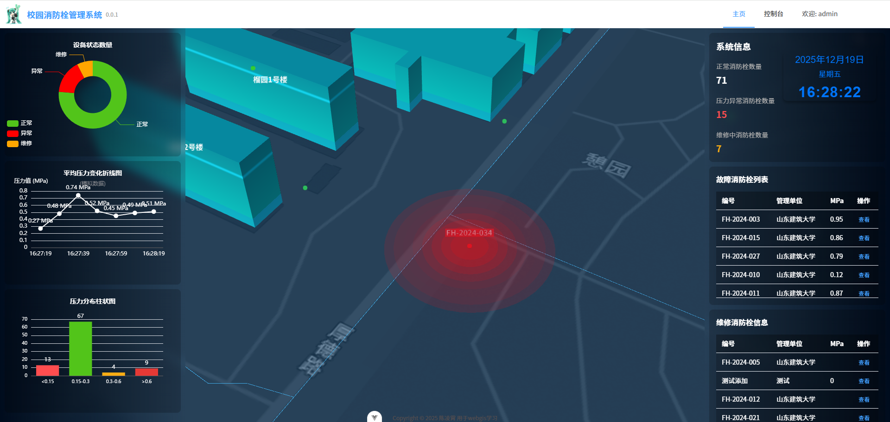
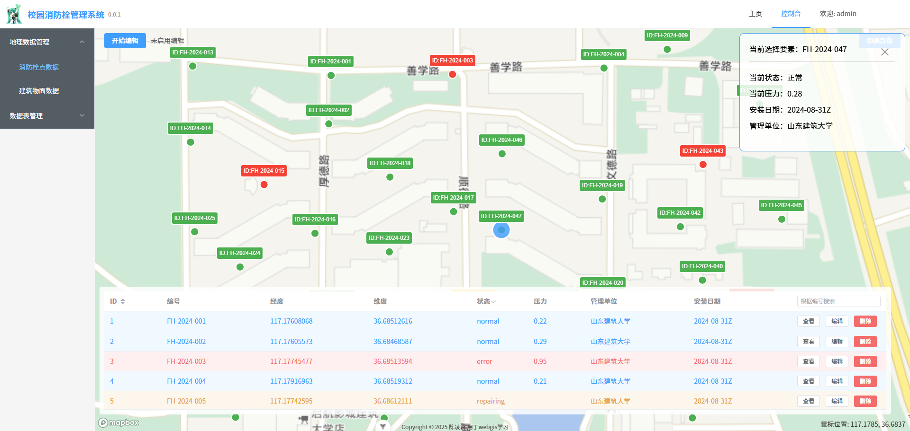
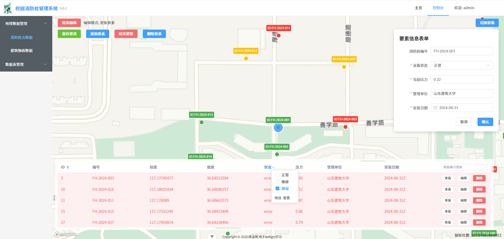
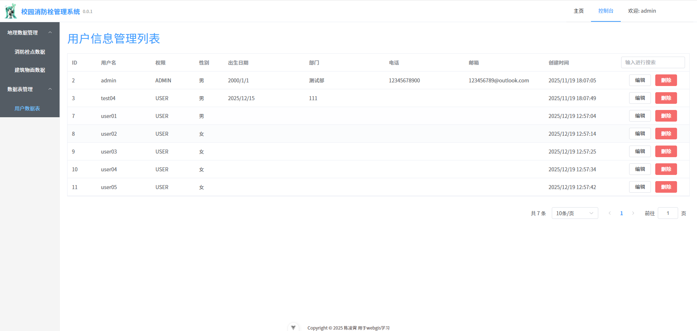
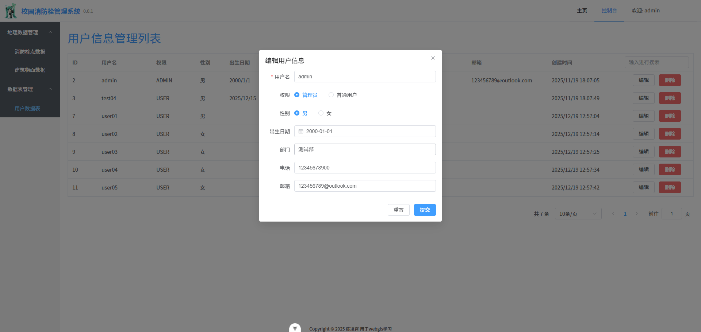

# 校园消防栓管理系统
校园消防栓管理系统是一个基于Web的综合管理系统，旨在帮助学校有效管理和监控校园内的消防栓设施。系统提供了消防栓地理信息可视化、实时状态监控、数据分析统计以及用户管理等功能。
<div align="center">
  
  
  
  
  
  
  
  
  
  
  
</div>


## 功能特性

### 核心功能

- **三维地图展示**: 基于Cesium的三维校园地图，包含校园边界、道路、建筑物和消防栓等要素
- **消防栓状态可视化**: 不同颜色标识消防栓状态（正常/故障/维修中）
- **实时数据监控**: 实时显示各类统计数据和设备状态
- **数据分析图表**: 设备状态饼图、压力分布柱状图、平均压力变化折线图
- **地理数据管理**: 消防栓点数据和建筑物面数据的增删改查操作
- **用户权限管理**: 管理员和普通用户分级权限控制

### 地图功能

- 交互式三维地图界面
- 支持多种底图切换（矢量图/影像图）
- 消防栓点击查看详情信息
- 编辑模式支持添加、更新、删除消防栓要素

### 数据分析

- 设备状态数量统计
- 压力分布区间分析
- 平均压力变化趋势监控

### 用户管理

- 用户注册与登录
- 管理员权限控制
- 用户信息维护
- 分页浏览大量用户数据

## 技术架构

### 前端技术栈

- **框架**: Vue 3 (Composition API)
- **语言**: TypeScript
- **UI库**: Element Plus
- **地图库**: Cesium.js, Mapbox GL
- **图表库**: ECharts
- **状态管理**: Pinia
- **构建工具**: Vite
- **包管理**: Pnpm

### 后端技术栈

- **框架**: Spring Boot 3.5
- **语言**: Java 17
- **数据库**: PostgreSQL
- **ORM**: MyBatis-Plus
- **安全认证**: JWT
- **构建工具**: Maven

### 前后端通信

- RESTful API设计
- JWT Token认证机制
- Cookie自动管理

## 快速开始

### 环境要求

- Node.js >= 20.19.0
- Java 17
- PostgreSQL数据库
- Maven 3.6+
- Pnpm

### 前端启动

```bash
# 进入前端目录
cd frontend

# 安装依赖
pnpm install

# 启动开发服务器
pnpm dev
```

### 后端启动

```bash
# 进入后端目录
cd backend

# 编译并启动
mvn spring-boot:run
```

## 项目结构

```
.
├── backend                 # 后端服务
│   ├── src/main/java       # Java源代码
│   │   └── com/example/backend
│   │       ├── controller  # 控制器层
│   │       ├── entity      # 实体类
│   │       ├── mapper      # 数据访问层
│   │       ├── service     # 业务逻辑层
│   │       └── utils       # 工具类
│   └── pom.xml             # Maven配置文件
├── frontend                # 前端应用
│   ├── src                 # 源代码目录git merge --no-ff release/v0.0.1
│   │   ├── api             # 接口调用封装
│   │   ├── assets          # 静态资源
│   │   ├── components      # 公共组件
│   │   ├── layouts         # 页面布局
│   │   ├── router          # 路由配置
│   │   ├── stores          # 状态管理
│   │   ├── utils           # 工具函数
│   │   └── views           # 页面视图
│   ├── index.html          # 入口HTML
│   └── vite.config.ts      # 构建配置
└── docs                    # 文档目录
```

## API接口

| 接口 | 方法 | 描述 |
|------|------|------|
| `/api/users/register` | POST | 用户注册 |
| `/api/users/login` | POST | 用户登录 |
| `/api/users/page` | GET | 分页查询用户 |
| `/api/users/{id}` | GET | 根据ID查询用户 |
| `/api/users/update` | PUT | 更新用户信息 |
| `/api/users/del/{id}` | DELETE | 删除用户 |

## 配置说明

### 前端环境变量

在 `frontend` 目录下创建 `.env` 文件：

```env
VITE_CESIUM_TOKEN=your_cesium_token
VITE_MAPBOX_TOKEN=your_mapbox_token
VITE_TIANDITU_TOKEN=your_tianditu_token
```

### 后端配置

在 `backend/src/main/resources/application.properties` 中配置数据库连接：

```properties
spring.datasource.url=jdbc:postgresql://localhost:5432/your_database
spring.datasource.username=your_username
spring.datasource.password=your_password
```

## 部署说明

### 前端部署

```bash
# 构建生产版本
pnpm build

# 部署dist目录到Web服务器
```

### 后端部署

```bash
# 打包应用
mvn clean package

# 运行打包后的JAR文件
java -jar target/backend-0.0.1-SNAPSHOT.jar
```

## 使用手册

详细的功能使用说明请参考 [使用手册](docs/user_manual.md)

## 许可证

本项目仅供学习交流使用。

## 技术支持

如有任何问题或建议，请联系项目维护者。
